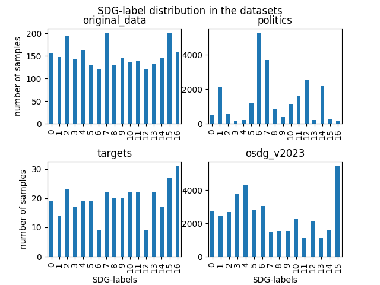
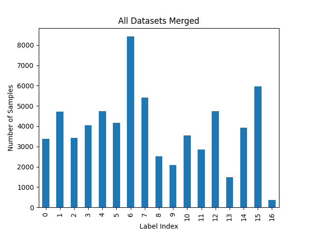

# Quality & Usability Project 3: Text Classification based on Sustainable Development Goals (SDGs)

---
## Table of Contents
1. [Project Description](#project-description)
2. [Datasets](#datasets)
3. [Model](#model)
4. [Setup](#setup)
5. [Usage](#usage)
6. [Results](#results)
7. [Contributors](#contributors)
8. [License](#license)


---
##  [Project Description](#project-description)

### Background

The Sustainable Development Goals (SDGs) are a collection of 17 global goals set by the United Nations General Assembly in 2015 for the year 2030. The SDGs are part of Resolution 70/1 of the United Nations General Assembly, the 2030 Agenda. The SDGs build on the principles agreed upon in Resolution A/RES/66/288, entitled "The Future We Want". This resolution was a broad intergovernmental agreement that acted as the precursor for the SDGs. The goals are broad-based and interdependent. The 17 sustainable development goals each have a list of targets that are measured with indicators. The total number of targets is 169. Below is an image of the 17 SDGs:


### Project Goal

The goal of this project is to classify text data into the 17 SDGs. The project will use 4 different datasets consisting of 65938 labeled sentences. The dataset is available on Huggingface. The project will use Natural Language Processing (NLP) techniques to classify the text data into the 17 SDGs. The project will use a transformer architecture combined with a classification layer to classify the textual data. Furthermore, the project will utilize a stratified K-fold approach along with the F1 score to evaluate the performance of the classification model and guarantee consistency throughout the unlabeled dataset.

### Project Motivation

The motivation for this project is to use NLP techniques to classify text data into the 17 SDGs. Moreover, the project will develop a evaluation pipeline that will be applied on 50 scraped published sustainability reports from various goods/services companies.

---

## [Datasets](#datasets)
The project will use 4 different datasets consisting of 65938 labeled sentences. The dataset is available on Huggingface. The datasets are as follows:

- [original_data.csv](https://github.com/amrayach/Quality_and_usability_SDG_project/blob/main/Data/original_data.csv): 2567 labeled sentences (supplied by the Quality & Usability supervision team)
- [politics.csv](https://github.com/amrayach/Quality_and_usability_SDG_project/blob/main/Data/politics.csv): 22977 labeled sentences (supplied by the Quality & Usability supervision team)
- [targets.csv](https://github.com/amrayach/Quality_and_usability_SDG_project/blob/main/Data/targets.csv): 332 labeled sentences (supplied by the Quality & Usability supervision team)
- [osdg_data.csv](https://github.com/amrayach/Quality_and_usability_SDG_project/blob/main/Data/osdg_v2023.csv): 40062 labeled sentences (The [OSDG Community Dataset (OSDG-CD)](https://zenodo.org/record/8107038)) 

The entire dataset is available on Huggingface: [amay01/Quality_and_usability_SDG_dataset](https://huggingface.co/datasets/amay01/Quality_and_usability_SDG_dataset)

### Dataset Distribution
#### Single Label Distribution



#### Merged Label Distribution



---

## [Model](#model)

The main adopted architecture for this project is the transformer model in combination with a classification layer. Multiple models were tested out on different combinations of the dataset, more on that can be found in the report later. The best performing model was the [BERT base model (cased)](https://huggingface.co/bert-base-cased) trained on a stratified 5-fold merged variant of the dataset.
The Model was trained using following hyperparameters:

- Batch Size: 16
- Learning Rate: 3e-5
- Epochs: 4
- Optimizer: AdamW
- Scheduler: LinearSchedulerWithWarmup
- Loss Function: CrossEntropyLoss
- Evaluation Metric: F1 Score
- Random Seed: 42
- Stratified K-Fold: 5

The final fine-tuned model is available on Huggingface: [amay01/quality_and_usability_sgd_17_classifier_flair](https://huggingface.co/amay01/quality_and_usability_sgd_17_classifier_flair)


---


## [Setup](#setup)

It is recommended to use a virtual environment for this project such as [miniconda](https://docs.conda.io/en/latest/miniconda.html). The project was developed using Python 3.10.0. The required packages can be installed using the following command:

```bash
conda create -n sdg_project python=3.10
conda activate sdg_project
pip install -r requirements.txt
```

Note: in case any libray or dependency is missing, please try to install it using the following command:

```bash 
pip install <library_name>
```

---

## [Usage](#usage)

The entire project pipeline is visualized as a flowchart which can be viewed on the following link [Framework Graph](https://drive.google.com/file/d/14aAbJLr7xbTsh_VzIe69OK1tV1jLERx4/view?usp=sharing)

The following subsections will provide a general explanation about the usage of each single script in the project pipeline. Furthermore, the scripts are commented and documented thoroughly with great details. The scripts are numbered in the order they should be executed.

All scripts can be executed using the following command:

```python
python <script_name>.py
```

### Note:
The following serves a human generated summary of the project pipeline. Collaboratively with the comments a machine generated documentation is generated using [ChatGPT May 24 Version](https://help.openai.com/en/articles/6825453-chatgpt-release-notes) which can be found under [Documentation ](Documentation%20).


### 1. [Data Preparation](https://github.com/amrayach/Quality_and_usability_SDG_project/blob/main/1_prep_dataset.py)

This is the first script in the project pipeline. The script is responsible for analyzing and preparing the dataset for the fine-tuning process. Initially the script download the resources (datasets) from Huggingface and ensures that everything is located correctly. 
Furthermore, the script visualizes the single and merged label distributions for the entire dataset. Finally, the script converts each respective dataset into a compatible flair pandas dataframe and passes it to a stratified k-fold functions which generates nearly balanced 5-fold splits of the data as (train/dev/test) sets.

### 2. [Model Fine-tuning](https://github.com/amrayach/Quality_and_usability_SDG_project/blob/main/2_ft_sdg_transformer_classifier.py)

This script is responsible for the fine-tuning process of the transformer model using [Flair](https://github.com/flairNLP/flair) and [Huggingface](https://huggingface.co/). Additionally, a class weight dictionary is generated and passed to the model in order to handle the imbalanced dataset. 
The script then takes the generated train/dev/test sets from the previously generated 5-folds and fine-tunes the transformer model on the train and dev set. The model is then evaluated on the test set and the best performing model is saved and the best fold model is adopted.

### 3. [Text Extraction](https://github.com/amrayach/Quality_and_usability_SDG_project/blob/main/3_text_extract.py)

Since all the scraped SDG documents are in PDF format, the text needs to be extracted from the PDF files. This script is responsible for extracting the text from the PDF files using [PyMuPDF](https://pymupdf.readthedocs.io/en/latest/index.html). The extraction process focuses on applying the extraction on a sentence level. Since the PDF files are not structured, the extraction process is not perfect and some sentences might be filtered out. Finally, all extraction sentences are joined and then segmented using a sentence segmenter from [Spacy](https://spacy.io/models/en#en_core_web_lg) and then saving them in a respective text file.  

#### Note:
The spacy model should be downloaded through the requirements.txt file. However, if the model is not downloaded, please apply the following command:

```python
python -m spacy download en_core_web_lg
```


### 4. [Keywords Count & Prediction Generation](https://github.com/amrayach/Quality_and_usability_SDG_project/blob/main/4_predict_sdg_document.py)

This script is a centric and resource joining stage since it uses all the previous generated resources and produces the needed results for the final company evaluation stage. The script is responsible for the following results: 

#### Keywords Count:
Part of the company evaluation is the count of the respective SDG keywords using the [SDG keyword list](https://github.com/amrayach/Quality_and_usability_SDG_project/blob/main/UoA-SDG-Keyword-List-Ver.-1.1.xlsx) which is provided by the [university of Auckland](https://www.sdgmapping.auckland.ac.nz/files/2020/10/UoA-SDG-Keyword-List-Ver.-1.1.xlsx). The script iterates over all the extracted files and counts the the number of keywords on a document level. The count is then multiplied with a respective weight correlating with the number of keywords per SDG since the keyword list are not size equivalent. Finally, the results are saved as pickled dictionary which contains the company name and the respective SDG keyword count. 

#### Prediction Generation:
Similar to the previous component the module iterates over the extracted files and generates a predictions on a sentence level using the fine-tuned model. 
Each sentence is passed to the model and only predictions with a threshold >= 0.55 are considered. A csv file is generated for each respective company document which contains the company name, the sentences and the respective predictions.

##### Note: 
The fine-tuned model should be downloaded automatically from huggingface. However, if the model is not downloaded, please download it manually from the following link [amay01/quality_and_usability_sgd_17_classifier_flair](https://huggingface.co/amay01/quality_and_usability_sgd_17_classifier_flair) and place it under [Model](https://github.com/amrayach/Quality_and_usability_SDG_project/tree/main/Model).


### 5. [Company Evaluation: Meta-Data & Classifier Predictions](https://github.com/amrayach/Quality_and_usability_SDG_project/blob/main/5_company_scoring_meta_predictions.py)

The first evaluation script joins the weights (sdg-prediction per sentence-count ratio) with the metadata (CO2 Emission per Million Euros Revenue t CO2e / m EUR ratio) 

The code makes use of the metadata in order to calculate a new Score. 
The new Score is a results from a previous score and a punish/reward to it.

### 6. [Company Evaluation: SDG Keywords](https://github.com/amrayach/Quality_and_usability_SDG_project/blob/main/6_company_scoring_keywords.py)

This code takes the results from the keyword model and calculate a score for each company. 

---

## [Results](#results)
From the beginning of the project our team created, curated and maintained a [Google Drive Storage](https://drive.google.com/drive/folders/1dCsQ7AagV2ro7ef8tgKzj_4JtVNX4kx7?usp=sharing) to keep all the resources and results in one place.
The storage contains the following resources:


---

## [Contributors](#contributors)

### Supervisors:
- [Charlott Frederike Jakob](c.jakob@tu-berlin.de)
- [Salar Mohtaj](salar.mohtaj@tu-berlin.de)

### Students: (some emails are missing)
- [Ammer Ayach]()
- [Pere Joan Fullana Mora]()
- [Bela Kristof Katschinski]()
- [Hadhemi Mejri]()
- [Thi Ngoc Anh Do](thi.na.do@campus.tu-berlin.de)
- [Blanka Karolina Bogucka](blanka.bogucka@campus.tu-berlin.de)

---

## [License](#license)
The project is licensed under the Apache License. See [LICENSE](https://github.com/amrayach/Quality_and_usability_SDG_project/blob/main/LICENSE) for more information.

---